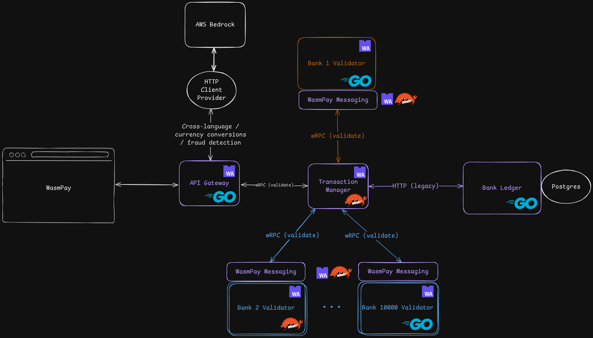
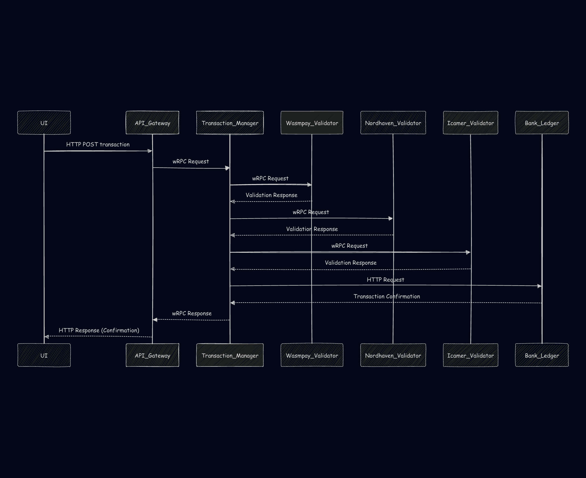

# wasmpay

wasmpay is a bank-to-bank payments platform built on the [CNCF project wasmCloud](https://wasmcloud.com). It supports processing transactions between banks regardless of currency, language or country.

The wasmpay platform meets bank and regulatory requirements by supporting **custom validators**. Validators can approve or deny transactions based on custom rules, e.g. to restrict transactions to specific countries, currencies or amounts. Validators can be written in any language that can compile to a [WebAssembly Component](https://component-model.bytecodealliance.org/), even supporting rules that are described with code generated by an LLM.

## Platform architecture



## Transaction commit sequence

When the transaction manager receives a transaction, it validates the transaction with the wasmpay platform, the origin bank's validator, and the destination bank's validator before committing the transaction.



## Detailed component descriptions

1. The platform harness component [wasmpay-platform-harness](./wasmpay-platform-harness/) is the core of the wasmpay platform. It wraps every validator component before deployment via [WebAssembly Composition tooling](https://github.com/bytecodealliance/wac). This allows validators to implement a simple interface and leave the implementation of a message bus and HTTP to the platform harness. This component can be updated and upgraded without changing the validator at all.
1. The [api-gateway](./api-gateway/) which fronts the HTTP API and serves static web assets for the wasmpay frontend.
1. The [transaction-manager](./transaction-manager/) which is responsible for validating a transaction with the wasmpay platform and the origin/destination banks. If banks don't provide their own validator, it's assumed they will allow a transaction to go through.
1. The [wasmpay-validator](./wasmpay-validator/) component which implements `wasmpay:platform/validation` for extra runtime validation logic which can be changed at runtime.
1. The [nordhaven-validator](./nordhaven-validator/) is a sample validator component which implements `wasmpay:platform/validation` for a bank that only allows USD transactions.
1. The [icamer-validator](./icamer-validator/) is a sample validator component which implements `wasmpay:platform/validation` for a bank that only allows transactions in the USA and the UK.
1. The [untrusted-validator](./untrusted-validator/) component which implements `wasmpay:platform/validation` as generated by an AI model and serves as a template for AI generated components deployed straight to Cosmonic.

## Developing with a Platform Harness

Both the [icamer-validator (written in Go)](./icamer-validator/) and the [nordhaven-validator (written in Rust)](./nordhaven-validator/) implement validation rules specific to their bank to approve or deny transactions. These components implement the `wasmpay:platform/validation` interface, and then are composed with the [wasmpay-platform-harness](./wasmpay-platform-harness/). During composition, the validation function is wrapped by the platform harness to support schema migrations, initial validation, and to implement the HTTP server endpoint.

To make your own changes to one of these validators, run one of the following:

```bash
wash dev --work-dir icamer-validator
```

```bash
wash dev --work-dir nordhaven-validator
```

Then, send a request to the validator over HTTP:

```bash
make test-validate
```

In a platform harness pattern, developer teams work on user components that use high-level, language-agnostic APIs for common functionality like in-memory filesystem access or environment variables, without worrying about exactly how that functionality will be fulfilled.

## Running wasmpay

### wasmCloud

You can run wasmpay with published versions or locally built components.

#### Published versions

Prerequisites:

- [wash](https://wasmcloud.com/docs/installation/)
- [docker](https://docs.docker.com/engine/install/)
- `curl`
- `make`

```bash
# Run the ledger service (external bank database)
docker run \
    -p 8080:8080 \
    -v ./:/app ghcr.io/cosmonic-labs/wasmpay/ledger:0f82ed36c5916af7ccd07dbb826f7674098b0e92 \
    -bind-addr 0.0.0.0:8080 \
    -db-store /app/data.db
# In a different terminal window
# Run wasmpay
wash app deploy ./app.wadm.yaml
# Validate it deploys successfully
wash app status wasmpay
# Test transaction support and validation
make test-validate
make test-validate-invalid
```

#### Local built

Prerequisites:

- [wash](https://wasmcloud.com/docs/installation/)
- [docker](https://docs.docker.com/engine/install/)
- `curl`
- `make`
- [Go](https://go.dev/doc/install) toolchain
- [TinyGo](https://tinygo.org/getting-started/install/) toolchain
- [Rust](https://www.rust-lang.org/tools/install) toolchain with `wasm32-wasip2` target

```bash
# Run the ledger service (external bank database)
go run ./ledger -db-store ledger.db
# In a different terminal window
# Build and run wasmpay
make build
wash up -d
wash app deploy ./local.wadm.yaml
# Validate it deploys successfully
wash app status wasmpay
# Test transaction support and validation
make test-validate
make test-validate-invalid
```
